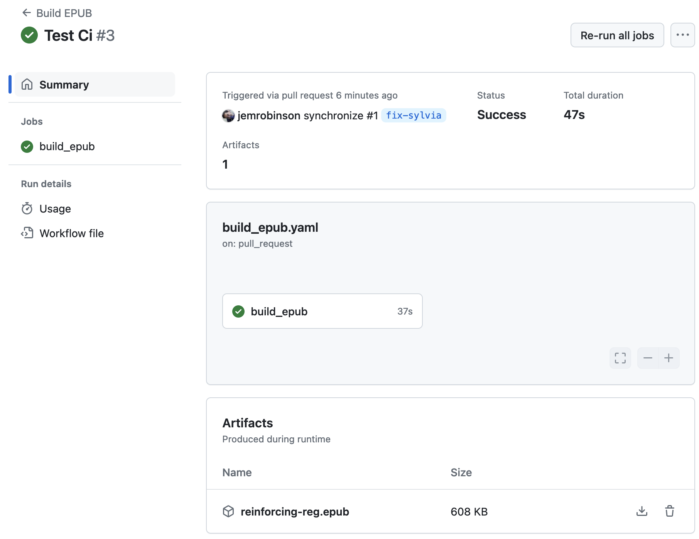

# who-is-that-ebook
Demo eBook for use in who-is-that project

# Build locally

To build the EPUB locally you need to:

- [Install `poetry`](https://python-poetry.org/docs/#installation)
- Install dependencies

```shell
$ poetry install
```

- Build the book

```shell
$ poetry run se build reinforcing-reg
```

# Download from GitHub

Each PR will run the `Build EPUB` workflow.
This produces the EPUB as a downloadable artifact.

